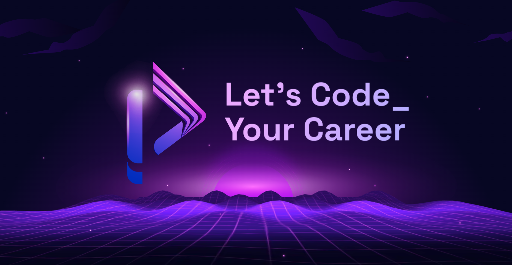
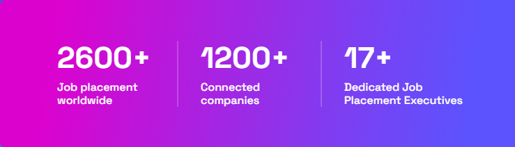

### Hi there 👋

## Our Impacts_

## X-Factors Of Programming Hero_
- 🌱 **Zero to Career:** A Complete Journey ...
- 👯 **Unlimited Support:** One to one Live support sessions 3 times a day...
- 🔭 **Job Placement:** 70-80% of the students who finish the course with SCIC get a job/intern within 3-6 months of their completion
- ⚡ **Offline Videos:** Offline mobile and desktop app. Offline assignment...
- 📫 **Project Based:** 45 projects. 20 projects in the content. 15+ projects in the conceptual session. 10+ practice projects.

## ✨ [Want to know more!](https://web.programming-hero.com/home/) ✨ 

